# Självstudier — Kartbanken (kartor.ifkmora.se)

Kursmaterial för självstudier med användarfall och steg-för-steg-övningar.
Materialet är uppdelat i **tre delar** efter behörighetsnivå:

| Del | Roll | Tidsåtgång (ungefär) |
|-----|------|----------------------|
| [Del 1 — Läsare](#del-1--läsare) | Läsare | 45–60 min |
| [Del 2 — Redaktör](#del-2--redaktör) | Redaktör | 60–90 min (förutsätter del 1) |
| [Del 3 — Administratör](#del-3--administratör) | Administratör | 45–60 min (förutsätter del 2) |

**Bilderna sköter sig själva.** Skärmdumparna hämtas automatiskt från en körande app — se
[Bilaga D — så uppdaterar du bilderna](#bilaga-d--så-uppdaterar-du-bilderna). Flödesscheman är
Mermaid-diagram som hämtas från samma källa som hjälpen i appen och behöver aldrig fotograferas.

**Mer hjälp i systemet:** [Hjälp — guide](/hjalp/guide) · [Release notes](/hjalp/release-notes)

---

## Roller i korthet

| Roll | Kan bland annat |
|------|-----------------|
| **Läsare** | Se publicerade kartor, kartförslag, egna banor, export, verifiera |
| **Redaktör** | Allt läsare kan + ladda upp/publicera versioner, utcheckning/incheckning |
| **Administratör** | Allt redaktör kan + områden, användare, integrera incheckningar, systeminställningar |

Varje högre roll **inkluderar** allt som lägre roller kan göra.

<!-- diagram:roller -->
**Roller — varje nivå inkluderar den under**

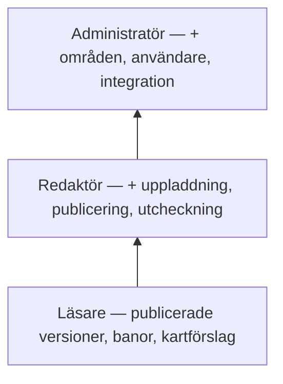
```mermaid
flowchart BT
  R[Läsare — publicerade versioner, banor, kartförslag]
  E[Redaktör — + uppladdning, publicering, utcheckning]
  A[Administratör — + områden, användare, integration]
  R --> E
  E --> A
```
<!-- /diagram:roller -->

---

# Del 1 — Läsare

> **Mål:** Du ska kunna hitta publicerade kartor, lämna kartförslag, lägga banor och exportera utsnitt — utan att behöva ladda upp eller publicera kartversioner.

---

## Modul 1.1 — Kom igång

### Teori

1. Gå till inloggningssidan och skapa konto (namn, e-post, lösenord minst 8 tecken).
2. Kontot får status **Väntar på godkännande** tills en administratör godkänner det.
3. Efter godkännande: logga in och öppna profilen via **ditt namn** i sidhuvudet.
4. I profilen ser du din **behörighet** och kan ställa in **e-postnotiser**.

Läsare får e-postnotiser men **inte** .ocd-bilaga i mail.

### Användarfall

**«Jag är ny tränare och vill komma åt klubbens kartor»**

1. Skapa konto.
2. Vänta på godkännande (kontakta kartansvarig om det dröjer).
3. Logga in och kontrollera att rollen är **Läsare**.

### Övning

- [ ] Skapa konto (eller logga in med befintligt).
- [ ] Öppna profilen och notera din roll.
- [ ] Slå på minst en e-postnotis om du vill få mail vid nya versioner.

### Bilder

<!-- bild:1.1 -->
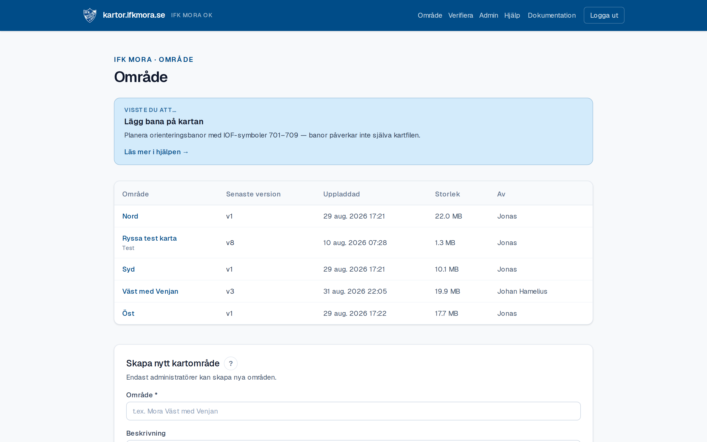

*Bild 1.1 — Inloggningssidan med flikarna «Logga in» och «Skapa konto».*
<!-- /bild:1.1 -->

<!-- bild:1.2 -->
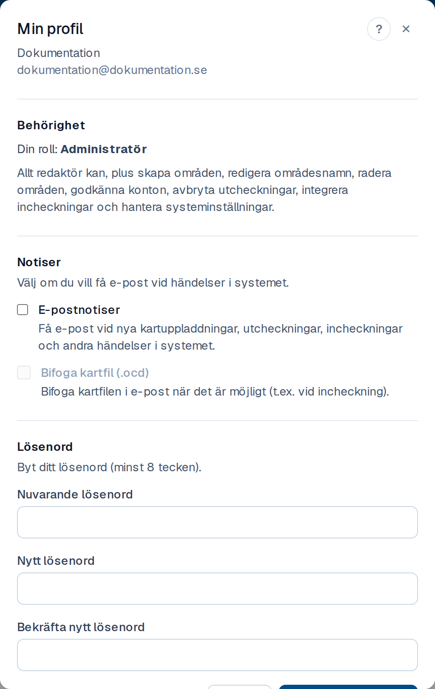

*Bild 1.2 — Profildialogen: behörighet «Läsare», kryssrutor för e-postnotiser, byt lösenord.*
<!-- /bild:1.2 -->

---

## Modul 1.2 — Hitta och läsa karta

### Teori

- **Startsidan** visar alla kartområden. Som läsare syns bara områden som har minst en **publicerad** kartversion.
- Klicka på områdesnamnet → **områdessidan** med versionshistorik.
- Klicka på en versionsrad (eller «Öppna karta») → **kartvyn** med zoom, panering och lagerpanel.
- På georefererade kartor finns knappen **Min position** (GPS).

### Användarfall

**«Jag ska kolla senaste publicerade kartan för Venjan inför träning»**

1. På startsidan: hitta området i listan.
2. Öppna områdessidan.
3. I versionshistoriken: hitta raden markerad **Publicerad**.
4. Öppna kartvyn och zooma till relevant del.

### Övning

- [ ] Hitta ett område på startsidan.
- [ ] Identifiera vilken version som är publicerad.
- [ ] Öppna kartan och zooma/panorera.
- [ ] (Valfritt) Testa «Min position» om kartan stödjer GPS.

### Bilder

<!-- bild:2.1 -->


*Bild 2.1 — Startsidan med lista över kartområden (namn, senaste version, datum).*
<!-- /bild:2.1 -->

<!-- bild:2.2 -->


*Bild 2.2 — Områdessidan: versionshistorik med en rad markerad som «Publicerad».*
<!-- /bild:2.2 -->

<!-- bild:2.3 -->
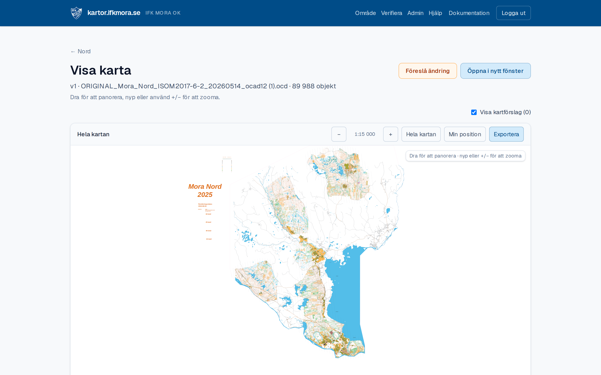

*Bild 2.3 — Kartvyn i webbläsaren: karta, zoomkontroller, lagerpanel.*
<!-- /bild:2.3 -->

---

## Modul 1.3 — Kartförslag

### Teori

Kartförslag låter dig föreslå ändringar på den **publicerade** kartan utan att redigera själva kartfilen.

1. På områdessidan: klicka **Föreslå ändring** (kräver publicerad version).
2. Välj ritverktyg: punkt, linje, polygon, radera.
3. **Navigera** / **Rita** — kartläge växlar automatiskt vid ritning.
4. På mobil: bifoga **foto** eller spela in **GPS-spår** (linje förenklas automatiskt).
5. Fyll i beskrivning och **Skicka in**.
6. Följ status på områdessidan eller under «Kartförslag».

Redaktörer granskar och hanterar förslagen; du behöver inte göra mer efter inskick.

<!-- diagram:kartforslag -->
**Flöde — skicka in kartförslag**

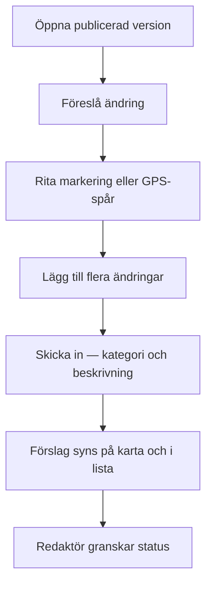
```mermaid
flowchart TD
  A[Öppna publicerad version] --> B[Föreslå ändring]
  B --> C[Rita markering eller GPS-spår]
  C --> D[Lägg till flera ändringar]
  D --> E[Skicka in — kategori och beskrivning]
  E --> F[Förslag syns på karta och i lista]
  F --> G[Redaktör granskar status]
```
<!-- /diagram:kartforslag -->

### Användarfall

**«Jag hittade en ny stig som saknas på kartan»**

1. Öppna området → **Föreslå ändring**.
2. Rita stigen som linje (eller importera GPS-spår).
3. Lägg till kort text: «Ny stig väster om sjön, ca 200 m».
4. Bifoga foto om möjligt.
5. Skicka in.

### Övning

- [ ] Öppna kartförslag på ett område med publicerad karta.
- [ ] Rita minst ett objekt (punkt eller linje).
- [ ] Skicka in ett testförslag (eller spara utkast mentalt om du inte vill skicka skarpt).
- [ ] Hitta förslaget i listan på områdessidan.

### Bilder

<!-- bild:3.1 -->
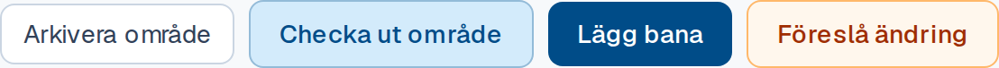

*Bild 3.1 — Områdessidan: knappen «Föreslå ändring» i sidhuvudet bredvid andra åtgärder.*
<!-- /bild:3.1 -->

<!-- bild:3.2 -->
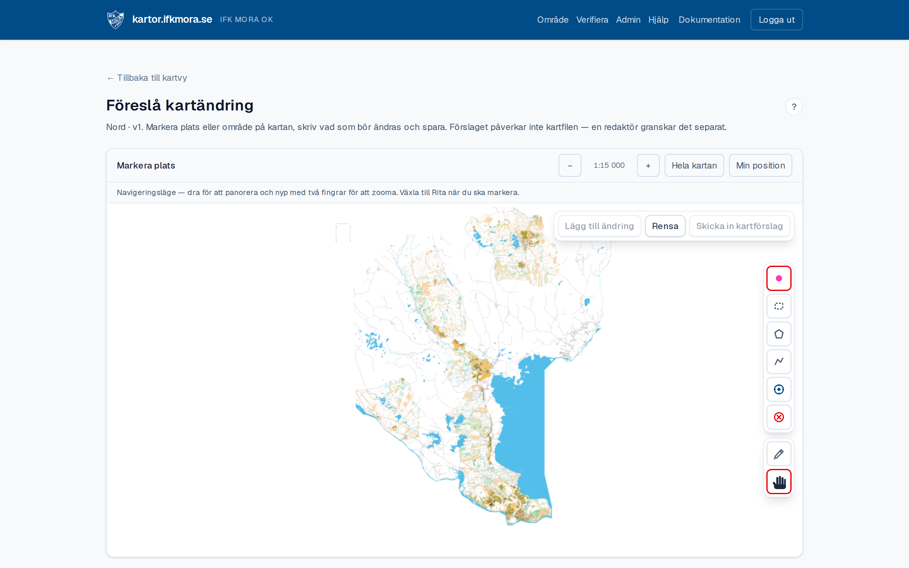

*Bild 3.2 — Kartförslagsvyn: ritverktyg till höger, «Skicka in» uppe till höger, karta i mitten.*
<!-- /bild:3.2 -->

<!-- bild:3.3 -->


*Bild 3.3 — Lista över kartförslag med status (t.ex. «Väntar på granskning»).*
<!-- /bild:3.3 -->

---

## Modul 1.4 — Lägg bana

### Teori

Banor ritas ovanpå kartans **publicerade** version. Banor sparas separat och **påverkar aldrig** kartfilen.

1. På områdessidan: **Lägg bana** (eller **Banor (N)** om banor redan finns).
2. Välj symbol i panelen till höger (701–709, IOF magenta).
3. Verktyg: **Rita**, **Flytta**, **Klipp**, **Radera**.
4. Lägg **start** (701), **kontroller** (703), **mål** (706) — banlinjer dras automatiskt.
5. **Klipp:** skapa luckor i kontrollcirkel eller sträcka så kartsymboler under syns; dra grön markör för att flytta lucka.
6. Spara bana, välj **Gör publik** om andra ska se den.
7. **Skuggbana:** visa annan bana halvtransparent för jämförelse.
8. **PDF-export** längst ned i banredigeraren.

<!-- diagram:bana -->
**Flöde — lägg bana**

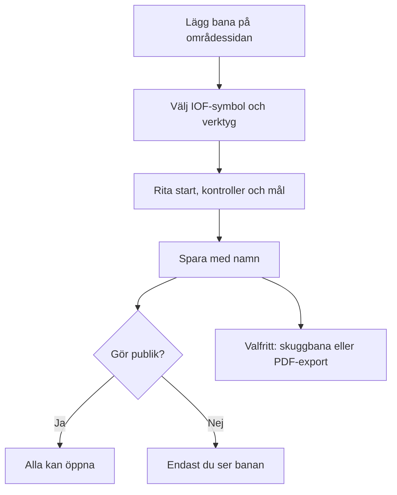
```mermaid
flowchart TD
  A[Lägg bana på områdessidan] --> B[Välj IOF-symbol och verktyg]
  B --> C[Rita start, kontroller och mål]
  C --> D[Spara med namn]
  D --> E{Gör publik?}
  E -->|Ja| F[Alla kan öppna]
  E -->|Nej| G[Endast du ser banan]
  D --> H[Valfritt: skuggbana eller PDF-export]
```
<!-- /diagram:bana -->

### Användarfall

**«Jag ska lägga en träningsbana på publicerad karta»**

1. Öppna **Lägg bana**.
2. Placera start och kontroller i terrängen.
3. Använd **Klipp** där kontrollcirklar täcker stenar eller höjder.
4. Spara med namn t.ex. «Träning 2026-03-15».
5. Exportera PDF till utskrift om behövs.

### Övning

- [ ] Öppna banredigeraren på ett område med publicerad karta.
- [ ] Lägg minst start + 2 kontroller + mål.
- [ ] Testa **Klipp** på minst en kontroll eller sträcka.
- [ ] Spara banan.
- [ ] (Valfritt) Exportera PDF.

### Bilder

<!-- bild:4.1 -->


*Bild 4.1 — Områdessidan: knapparna «Arkivera», «Checka ut», «Lägg bana»/«Banor (2)», «Föreslå ändring».*
<!-- /bild:4.1 -->

<!-- bild:4.2 -->
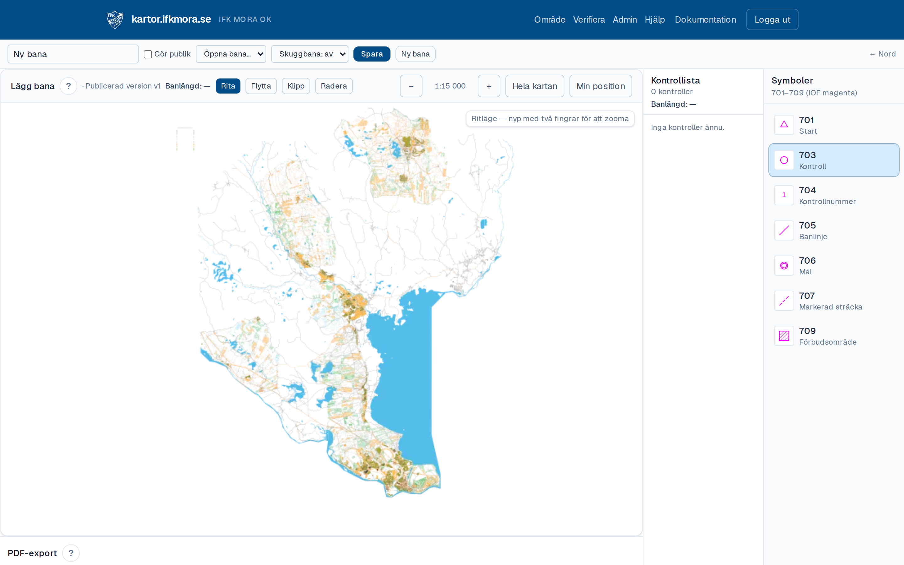

*Bild 4.2 — Banredigeraren: verktygsrad (Rita, Flytta, Klipp, Radera), kontrollista, symbolpanel.*
<!-- /bild:4.2 -->

<!-- bild:4.3 -->
**[BILD 4.3]** Bana med kontrollcirkel och lucka (Klipp) — kartsymbol syns genom luckan.

> Tas för hand: Öppna en bana, välj verktyget Klipp, klicka på en kontrollcirkel som ligger över en kartsymbol och zooma in innan du tar bilden.
<!-- /bild:4.3 -->

<!-- bild:4.4 -->
**[BILD 4.4]** (Valfritt) Skuggbana vald i rullgardinsmenyn, halvtransparent overlay.

> Tas för hand: Kräver minst två sparade banor på samma område. Välj skuggbana i rullgardinsmenyn.
<!-- /bild:4.4 -->

---

## Modul 1.5 — Export och verifiera

### Teori

**Export från kartvyn**

- Välj utsnitt på kartan.
- Exportera som **PDF**, **OCAD (.ocd)** eller **GeoTIFF (.tif)** beroende på behov.

**Verifiera** (`/verifiera`)

- Jämför **två .ocd-filer** tillfälligt utan att spara dem som version i systemet.
- Bra innan du skickar fil till någon som ska ladda upp.

**Jämföra versioner** (inom systemet)

- På områdessidan: välj två versioner i jämförelseväljaren.
- Diff visar tillagda (grönt), borttagna (rött) och ändrade objekt.

### Användarfall

**«Jag vill skriva ut ett utsnitt till banläggning på papper»**

1. Öppna publicerad kartversion i kartvyn.
2. Zooma till önskat område.
3. Exportera som PDF.

### Övning

- [ ] Exportera ett kartutsnitt (PDF räcker).
- [ ] (Valfritt) Öppna **Verifiera** och ladda upp två lokala .ocd-filer.
- [ ] (Valfritt) Jämför två versioner på ett område du har tillgång till.

### Bilder

<!-- bild:5.1 -->
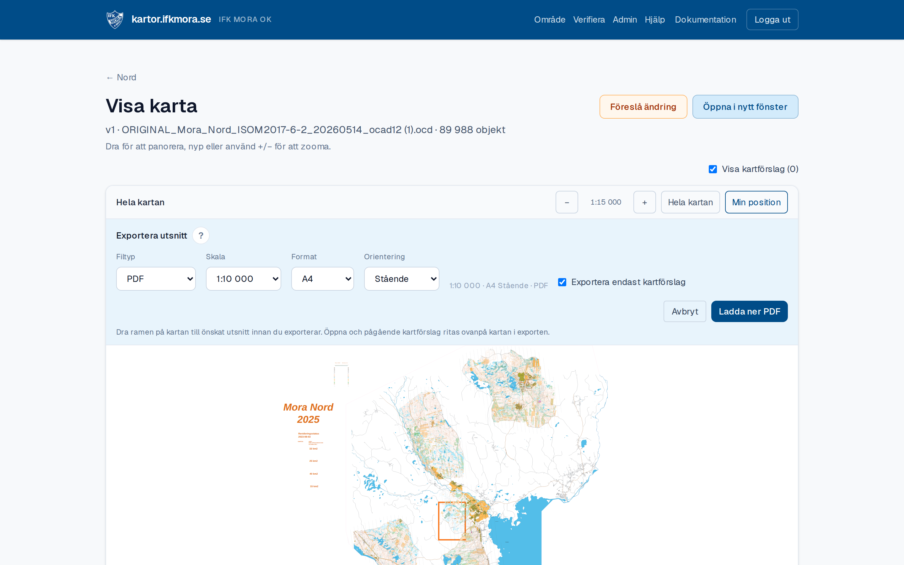

*Bild 5.1 — Exportdialog i kartvyn med val av format (PDF / OCAD / GeoTIFF).*
<!-- /bild:5.1 -->

<!-- bild:5.2 -->
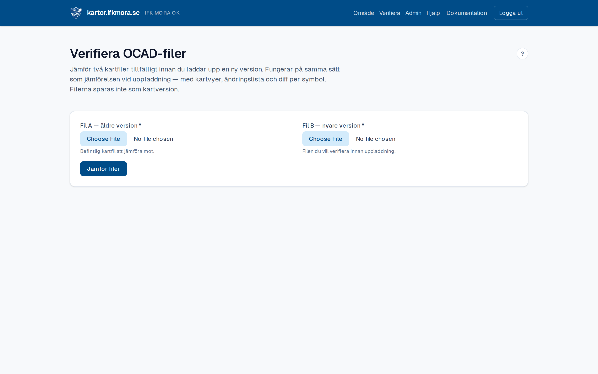

*Bild 5.2 — Sidan Verifiera med uppladdning av två filer och diff-resultat.*
<!-- /bild:5.2 -->

<!-- bild:5.3 -->


*Bild 5.3 — (Valfritt) Jämförelsevy mellan två versioner med färgkodad diff.*
<!-- /bild:5.3 -->

---

## Del 1 — Slutchecklista

När du kan bocka av allt nedan är del 1 klar:

- [ ] Logga in och förstå min roll som läsare
- [ ] Hitta område och öppna publicerad kartversion
- [ ] Skicka in (eller simulera) ett kartförslag
- [ ] Skapa och spara en bana med minst tre kontroller
- [ ] Använda Klipp minst en gång
- [ ] Exportera ett kartutsnitt

---

# Del 2 — Redaktör

> **Mål:** Du ska kunna ladda upp och publicera kartversioner, arbeta med utcheckning/incheckning och granska kartförslag.
>
> **Förutsättning:** Genomför [Del 1](#del-1--läsare) först.

---

## Modul 2.1 — Ladda upp och granska versioner

### Teori

- Varje uppladdning av en **.ocd-fil** skapar en **ny version**. Tidigare versioner behålls.
- Nya versioner är **opublicerade** tills du publicerar dem.
- Efter uppladdning jämförs automatiskt med föregående version (**diff**).
- Du ser **alla** versioner (även opublicerade); läsare ser bara publicerade.

Steg:

1. Öppna områdessidan.
2. Under **Ladda upp ny version**: välj fil, valfri kommentar, ladda upp.
3. Vänta tills parsning är klar (objektantal syns).
4. Granska diff mot föregående version.

<!-- diagram:uppladdning -->
**Flöde — ladda upp ny version**

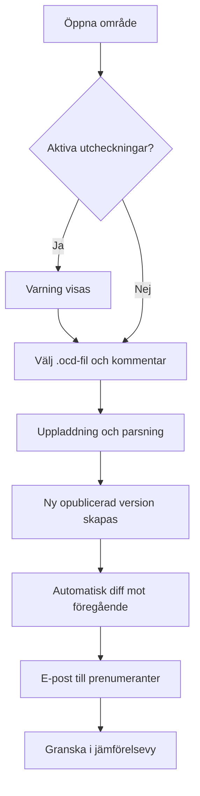
```mermaid
flowchart TD
  O[Öppna område] --> W{Aktiva utcheckningar?}
  W -->|Ja| V[Varning visas]
  V --> U
  W -->|Nej| U[Välj .ocd-fil och kommentar]
  U --> P[Uppladdning och parsning]
  P --> N[Ny opublicerad version skapas]
  N --> D[Automatisk diff mot föregående]
  D --> M[E-post till prenumeranter]
  M --> R[Granska i jämförelsevy]
```
<!-- /diagram:uppladdning -->

### Användarfall

**«Ny terränginventering — ladda upp och granska vad som ändrats»**

1. Ladda upp ny .ocd efter inventering.
2. Öppna diff: kontrollera att ändringar stämmer.
3. Ladda ner versionen om du behöver backup lokalt.

### Övning

- [ ] Ladda upp en testversion ( eller använd befintlig omredigering).
- [ ] Granska diff mot föregående version.
- [ ] Läs versionskommentar och metadata (uppladdare, datum, storlek).

### Bilder

<!-- bild:6.1 -->
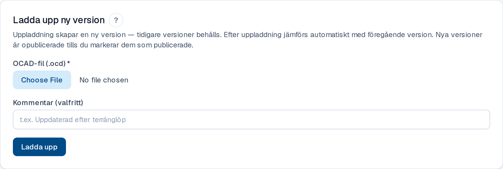

*Bild 6.1 — Områdessidan: avsnittet «Ladda upp ny version» med filväljare och kommentarsfält.*
<!-- /bild:6.1 -->

<!-- bild:6.2 -->


*Bild 6.2 — Diff-vy efter uppladdning: grönt = tillagt, rött = borttaget, gult = ändrat.*
<!-- /bild:6.2 -->

<!-- bild:6.3 -->
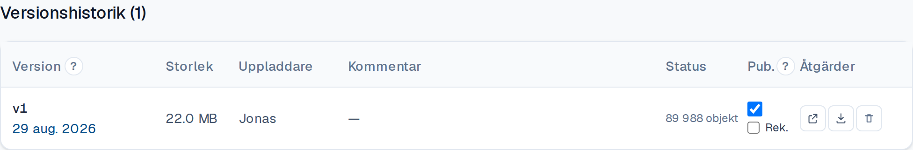

*Bild 6.3 — Versionshistorik med både publicerade och opublicerade rader.*
<!-- /bild:6.3 -->

---

## Modul 2.2 — Publicering

### Teori

- Bara **en version åt gången** kan vara **publicerad** per område.
- När du publicerar en ny version **avpubliceras** den tidigare automatiskt.
- **Läsare** och funktioner som **Lägg bana** / **Kartförslag** använder den publicerade versionen.
- **Rekommenderad version** kan markeras separat (vägledning, inte samma som publicerad).

<!-- diagram:publicering -->
**Flöde — publicera version**

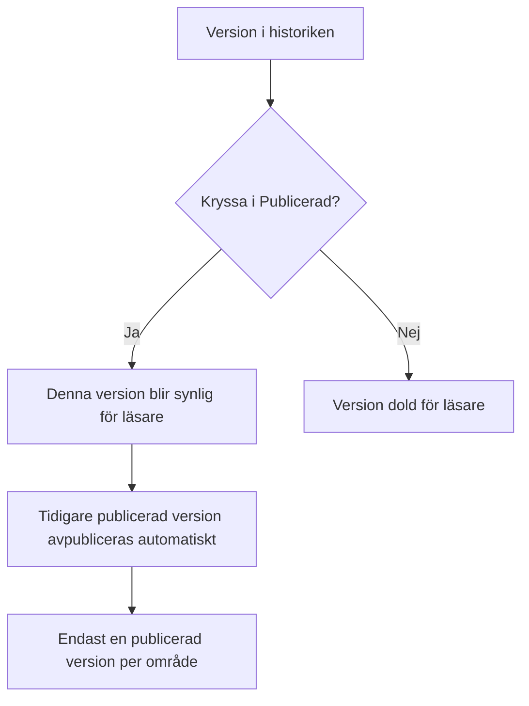
```mermaid
flowchart TD
  V[Version i historiken] --> C{Kryssa i Publicerad?}
  C -->|Ja| P[Denna version blir synlig för läsare]
  P --> U[Tidigare publicerad version avpubliceras automatiskt]
  C -->|Nej| H[Version dold för läsare]
  U --> E[Endast en publicerad version per område]
```
<!-- /diagram:publicering -->

### Användarfall

**«Terrängcup-kartan är klar — publicera så tränare kan lägga banor»**

1. Kontrollera diff och att versionen är korrekt.
2. Klicka **Publicera** på versionsraden.
3. Kontrollera statusbanner på områdessidan: «Publicerad version vN».

### Övning

- [ ] Publicera en opublicerad version ( i testmiljö om möjligt).
- [ ] Verifiera att områdesstatus uppdaterats.
- [ ] (Valfritt) Avpublicera och publicera igen för att se beteendet.

### Bilder

<!-- bild:7.1 -->


*Bild 7.1 — Versionsrad med knapp «Publicera» och badge «Publicerad».*
<!-- /bild:7.1 -->

<!-- bild:7.2 -->


*Bild 7.2 — AreaStatusBanner: «Publicerad version v3», ev. antal väntande kartförslag.*
<!-- /bild:7.2 -->

---

## Modul 2.3 — Utcheckning och incheckning

### Teori

Utcheckning låter flera redaktörer arbeta parallellt i OCAD på **olika delar** av samma karta.

<!-- diagram:utcheckning -->
**Status — utcheckning till integrerad version**

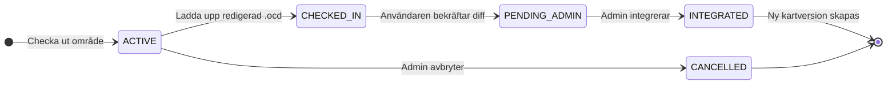
```mermaid
stateDiagram-v2
  direction LR
  [*] --> ACTIVE: Checka ut område
  ACTIVE --> CHECKED_IN: Ladda upp redigerad .ocd
  CHECKED_IN --> PENDING_ADMIN: Användaren bekräftar diff
  PENDING_ADMIN --> INTEGRATED: Admin integrerar
  INTEGRATED --> [*]: Ny kartversion skapas
  ACTIVE --> CANCELLED: Admin avbryter
  CANCELLED --> [*]
```
<!-- /diagram:utcheckning -->

**Checka ut**

1. På områdessidan: **Checka ut område**.
2. Rita polygon på kartan (området du reserverar).
3. Ladda ner **utchecknings-.ocd**.
4. Redigera i OCAD lokalt.

**Medan utcheckning pågår**

- Andra redaktörer ser din yta på **översiktskartan** (read-only).
- Du ser andras utcheckningar.

**Checka in**

1. Öppna utcheckningen från listan.
2. Ladda upp uppdaterad .ocd.
3. Granska **diff** (utcheckad vs inlämnad).
4. **Bekräfta** — ändringen väntar på administratörs **integration**.

### Användarfall

**«Jag ska uppdatera norra delen medan kollegan har södra»**

1. Checka ut norra polygonen.
2. Redigera i OCAD.
3. Checka in och bekräfta diff.
4. Informera admin att incheckning väntar på integration.

### Övning

- [ ] Starta en utcheckning (testpolygon räcker).
- [ ] Hitta utcheckningen i listan och översiktskartan.
- [ ] (Valfritt) Genomför incheckning med fil om du har test-.ocd.

### Bilder

<!-- bild:8.1 -->
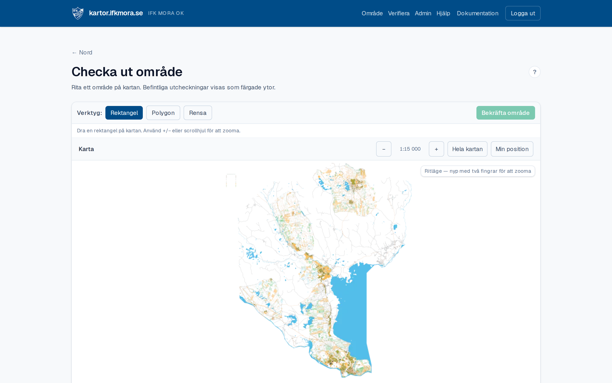

*Bild 8.1 — Utcheckning: rita polygon på kartan, bekräfta utcheckning.*
<!-- /bild:8.1 -->

<!-- bild:8.2 -->
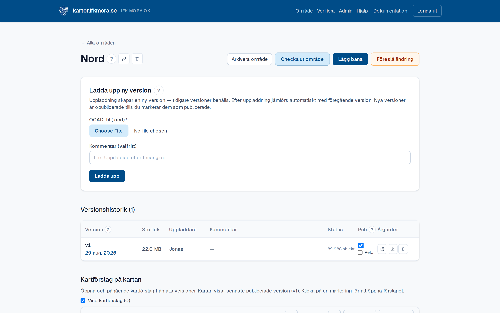

*Bild 8.2 — Översiktskarta med färgade utcheckningsytor och namn.*
<!-- /bild:8.2 -->

<!-- bild:8.3 -->
**[BILD 8.3]** Incheckning: diff mellan utcheckad fil och inlämnad fil.
<!-- /bild:8.3 -->

<!-- bild:8.4 -->
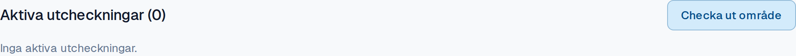

*Bild 8.4 — Utcheckningslistan på områdessidan med status «Aktiv».*
<!-- /bild:8.4 -->

---

## Modul 2.4 — Granska kartförslag

### Teori

- Alla godkända användare kan skicka **kartförslag**; redaktörer **granskar** dem.
- På områdessidan: se antal väntande förslag i statusbanner och under avsnittet **Kartförslag**.
- Öppna enskilt förslag: se ritning, text, foto, GPS.
- Markera som hanterat / gransat enligt ert arbetssätt.
- Exportera **PDF-rapport** över kartförslag vid behov.

Integrering i kartfil sker manuellt i OCAD och via ny version — förslagen sparas separat.

### Användarfall

**«Tränare skickade stigförslag — bedöm om det ska in i nästa version»**

1. Öppna förslaget på kartan.
2. Jämför med publicerad karta.
3. Besluta: ta med i nästa inventering / avvisa / komplettera med fråga till avsändaren.

### Övning

- [ ] Hitta lista över kartförslag på ett område.
- [ ] Öppna minst ett förslag och granska innehållet.
- [ ] (Valfritt) Exportera PDF-rapport.

### Bilder

<!-- bild:9.1 -->
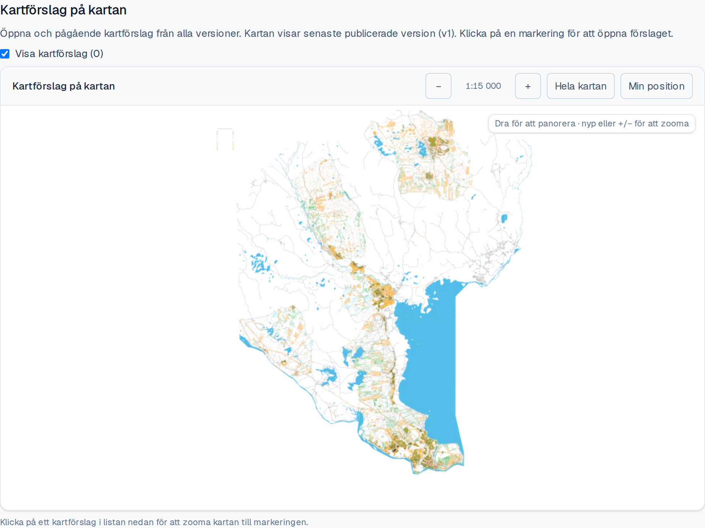

*Bild 9.1 — Områdessidan: kartförslagssektion med antal väntande.*
<!-- /bild:9.1 -->

<!-- bild:9.2 -->
**[BILD 9.2]** Detaljvy för ett kartförslag med karta, beskrivning och bifogat foto.
<!-- /bild:9.2 -->

---

## Modul 2.5 — Jämföra versioner och rekommendation

### Teori

- **Jämförelseväljaren** på områdessidan: välj två versioner → öppna jämförelsevy.
- Exportera diff som PDF för dokumentation.
- **Rekommenderad version** — markera vilken version som bör användas som referens ( separat från publicerad).

<!-- diagram:jamforelse -->
**Flöde — jämföra versioner**

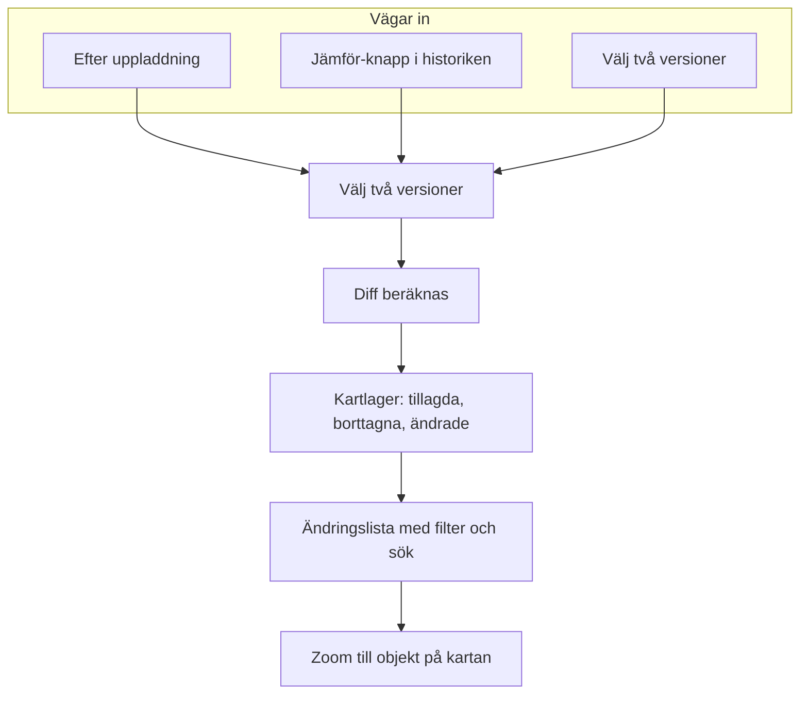
```mermaid
flowchart TD
  S[Välj två versioner] --> B[Diff beräknas]
  B --> K[Kartlager: tillagda, borttagna, ändrade]
  K --> L[Ändringslista med filter och sök]
  L --> Z[Zoom till objekt på kartan]

  subgraph entry ["Vägar in"]
    E1[Efter uppladdning]
    E2[Jämför-knapp i historiken]
    E3[Välj två versioner]
  end
  E1 --> S
  E2 --> S
  E3 --> S
```
<!-- /diagram:jamforelse -->

### Användarfall

**«Vad ändrades mellan v2 och v3?»**

1. Välj version 2 och 3 i jämförelseväljaren.
2. Granska diff i kartvy.
3. Exportera PDF om du behöver dela med kartgruppen.

### Övning

- [ ] Jämför två valfria versioner på samma område.
- [ ] Identifiera minst tre typer av ändringar i diff.

### Bilder

<!-- bild:10.1 -->
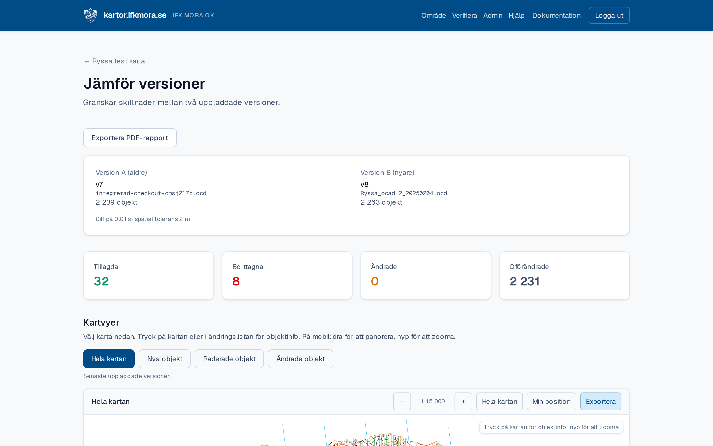

*Bild 10.1 — Versionsjämförelse: väljare + kartvy med diff.*
<!-- /bild:10.1 -->

<!-- bild:10.2 -->
**[BILD 10.2]** (Valfritt) PDF-export av versionsdiff.

> Tas för hand: Klicka «Exportera PDF-rapport» i jämförelsevyn och ta bilden på den nedladdade PDF:en.
<!-- /bild:10.2 -->

---

## Del 2 — Slutchecklista

- [ ] Laddat upp version och granskat diff
- [ ] Publicerat (eller förstått flödet för) en version
- [ ] Checkat ut och förstått översiktskartan
- [ ] Granskat minst ett kartförslag
- [ ] Jämfört två versioner i diff-vyn

---

# Del 3 — Administratör

> **Mål:** Du ska kunna hantera användare, områden, integrera incheckningar och övervaka systemet.
>
> **Förutsättning:** Genomför [Del 2](#del-2--redaktör) först.

---

## Modul 3.1 — Användare och konton

### Teori

- Nya konton hamnar i **Väntar på godkännande**.
- Admin → **Användare**: godkänn, avvisa eller ändra roll.
- Roller: **Läsare**, **Redaktör**, **Administratör**.
- Vid godkännande skickas e-post ( om SMTP är konfigurerat ) med tilldelad roll.
- Admin kan även återställa lösenord och hantera avvisade konton.

<!-- diagram:anvandare -->
**Flöde — användarhantering**

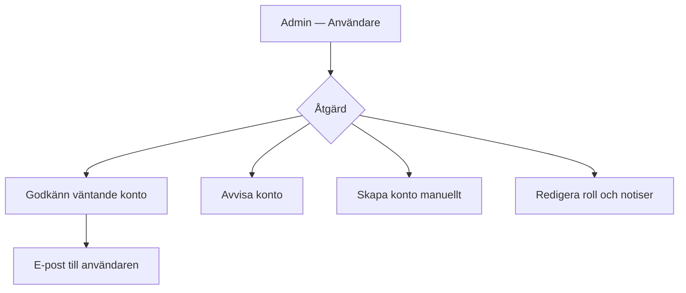
```mermaid
flowchart TD
  A[Admin — Användare] --> B{Åtgärd}
  B --> C[Godkänn väntande konto]
  B --> D[Avvisa konto]
  B --> E[Skapa konto manuellt]
  B --> F[Redigera roll och notiser]
  C --> G[E-post till användaren]
```
<!-- /diagram:anvandare -->

### Användarfall

**«Ny tränare registrerad — ge läsarbehörighet»**

1. Admin → Användare.
2. Hitta pending-konto.
3. Godkänn med roll **Läsare**.
4. Bekräfta att användaren kan logga in.

### Övning

- [ ] Öppna Admin → Användare.
- [ ] Identifiera kolumner: namn, e-post, roll, status.
- [ ] (I testmiljö) Godkänn ett testkonto med lämplig roll.

### Bilder

<!-- bild:11.1 -->
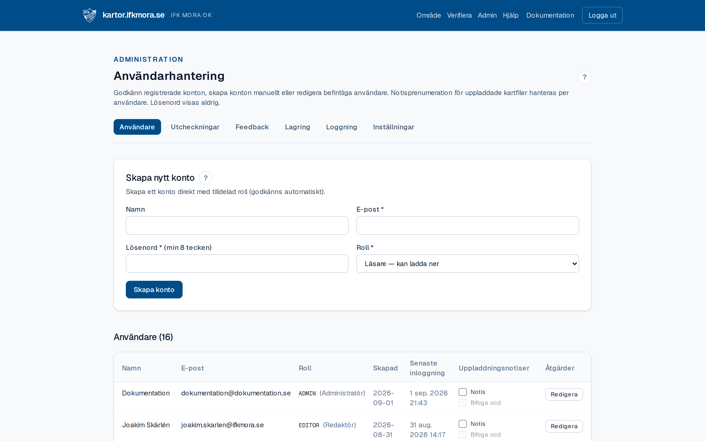

*Bild 11.1 — Admin → Användare: tabell med filter «Väntar på godkännande».*
<!-- /bild:11.1 -->

<!-- bild:11.2 -->
**[BILD 11.2]** Dialog för godkännande: välj roll Läsare / Redaktör / Administratör.

> Tas för hand: Kräver ett konto med status «Väntar på godkännande». Öppna godkännandedialogen utan att bekräfta.
<!-- /bild:11.2 -->

---

## Modul 3.2 — Områden, namn och arkivering

### Teori

- **Skapa område:** under startsidan, formulär «Skapa nytt kartområde» (namn + beskrivning).
- Första .ocd laddas upp på områdets detaljsida — inte vid skapandet.
- **Byta namn:** ikonen «Redigera namn» vid titeln ( URL/slug ändras inte ).
- **Arkivera område:** döljer för normal användning; admin kan återställa.
- **Radera område:** permanent — alla versioner, banor, utcheckningar m.m. försvinner.

### Användarfall

**«Nytt kartprojekt Siljansnäs 2026»**

1. Skapa område «Siljansnäs 2026» med kort beskrivning.
2. Be redaktör ladda upp första versionen.
3. Publicera när klar.

### Övning

- [ ] (Testmiljö) Skapa område eller granska befintligt.
- [ ] Förstå skillnad arkivera vs radera.
- [ ] Hitta «Arkivera område» på områdessidan.

### Bilder

<!-- bild:12.1 -->
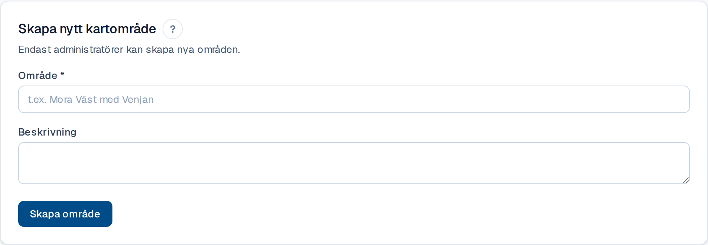

*Bild 12.1 — Startsidan: «Skapa nytt kartområde» under listan.*
<!-- /bild:12.1 -->

<!-- bild:12.2 -->
**[BILD 12.2]** Områdessidan: «Arkivera område» och meddelande om arkiverat område.

> Tas för hand: Arkivera ett testområde och ta bilden innan du återställer det.
<!-- /bild:12.2 -->

<!-- bild:12.3 -->
**[BILD 12.3]** (Valfritt) Redigera namn vid sidtitel.

> Tas för hand: Klicka redigeringsikonen vid områdestiteln och ta bilden med fältet öppet.
<!-- /bild:12.3 -->

---

## Modul 3.3 — Utcheckningar och integration

### Teori

**Redaktörens del:** checka ut → redigera → checka in → bekräfta diff.

**Administratörens del:**

- **Avbryt utcheckning** om någon blockerar eller slutat arbeta.
- **Integrera incheckning** — slår ihop godkänd incheckning till ny kartversion i systemet.
- Admin → **Utcheckningar** — översikt över alla aktiva och väntande.

Efter integration skapas ny version; redaktör kan publicera den.

### Användarfall

**«Redaktör checkade in norra delen — integrera till huvudversion»**

1. Admin → Utcheckningar ( eller områdessidan ).
2. Öppna incheckning med status «Väntar på integration».
3. Granska diff en sista gång.
4. **Integrera** → ny versionsnummer skapas.
5. Informera redaktör att publicera vid behov.

### Övning

- [ ] Hitta Admin → Utcheckningar.
- [ ] Förstå skillnad: aktiv utcheckning / incheckad väntar / integrerad.
- [ ] (Valfritt) Genomför integration i testmiljö.

### Bilder

<!-- bild:13.1 -->
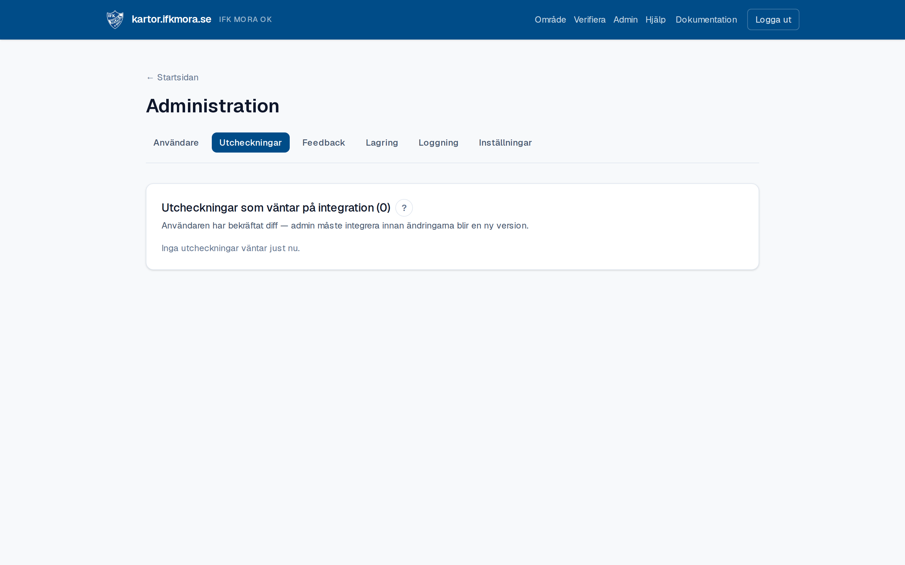

*Bild 13.1 — Admin → Utcheckningar: lista med statuskolumner.*
<!-- /bild:13.1 -->

<!-- bild:13.2 -->
**[BILD 13.2]** Integrera incheckning: bekräftelsedialog och resultat «Version vN skapad».

> Tas för hand: Kräver en incheckning med status «Väntar på integration». Ta bilden på bekräftelsedialogen.
<!-- /bild:13.2 -->

<!-- bild:13.3 -->
**[BILD 13.3]** (Valfritt) Avbryt utcheckning — adminåtgärd.

> Tas för hand: Öppna en aktiv utcheckning och ta bilden på dialogen för «Avbryt utcheckning».
<!-- /bild:13.3 -->

---

## Modul 3.4 — System, lagring och feedback

### Teori

| Admin-sida | Syfte |
|------------|--------|
| **Inställningar** | SMTP, e-postmallar, testa utskick |
| **Lagring** | Förbrukning per område, versioner, banor |
| **Loggning** | Audit-logg, felsökning |
| **Feedback** | Användares buggar och förbättringsförslag |
| **Utcheckningar** | Se modul 3.3 |

Användare når feedback via **Hjälp → Buggar / Förbättringar**.

### Användarfall

**«Kolla att lagringen inte närmar sig gräns»**

1. Admin → Lagring.
2. Sortera på största områden.
3. Överväg arkivering av gamla projekt.

### Övning

- [ ] Besök Admin → Lagring och Inställningar.
- [ ] Hitta var SMTP testas.
- [ ] (Valfritt) Läs igenom senaste loggposter.

### Bilder

<!-- bild:14.1 -->
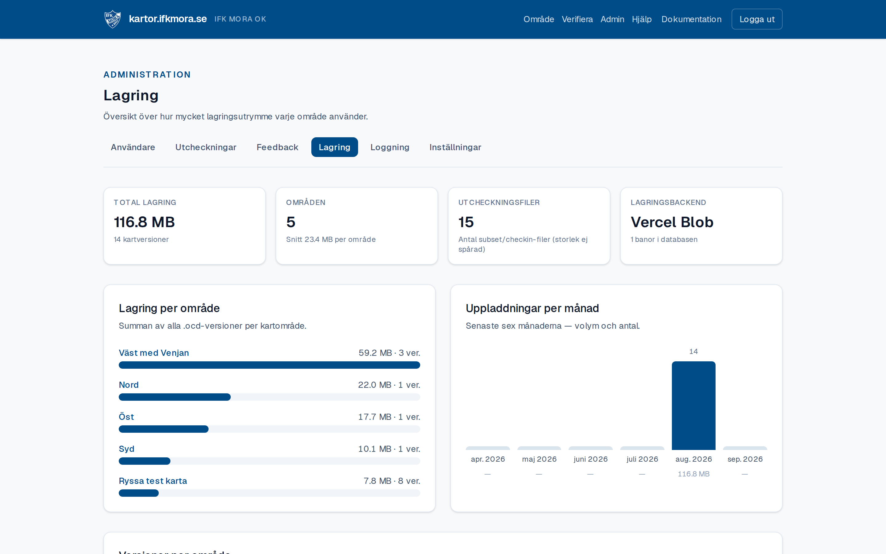

*Bild 14.1 — Admin → Lagring: tabell med områden, antal versioner, banor, storlek.*
<!-- /bild:14.1 -->

<!-- bild:14.2 -->
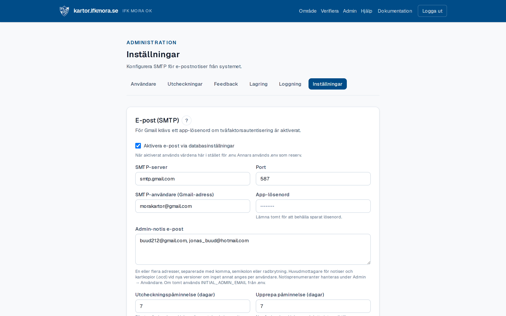

*Bild 14.2 — Admin → Inställningar: SMTP-fält och «Skicka testmail».*
<!-- /bild:14.2 -->

<!-- bild:14.3 -->
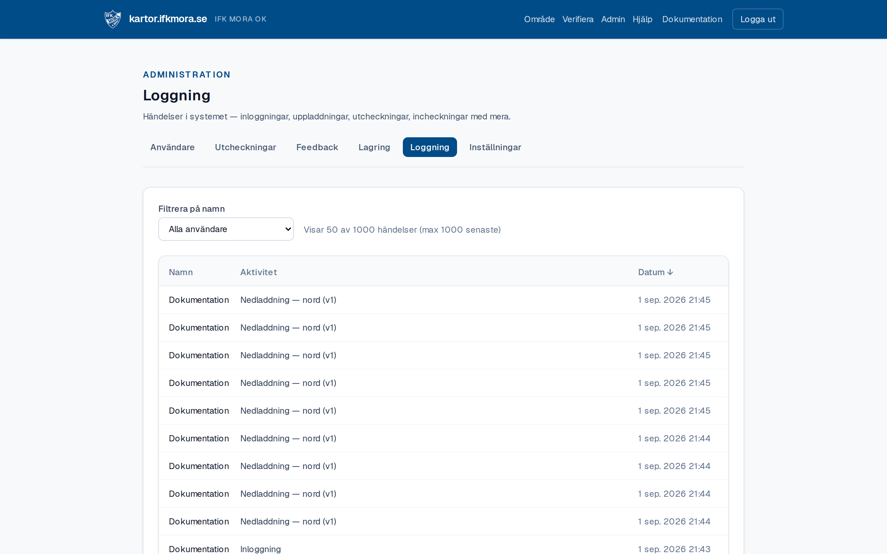

*Bild 14.3 — (Valfritt) Admin → Loggning eller Feedback.*
<!-- /bild:14.3 -->

---

## Modul 3.5 — Publicering och helhetsflöde (adminperspektiv)

### Teori — typiskt kartprojekt

```
Skapa område (admin)
    → Ladda upp v1 (redaktör)
    → Publicera (redaktör)
    → Parallellt: kartförslag + banor (läsare/tränare)
    → Utcheckningar (redaktörer)
    → Integration (admin)
    → Publicera ny version (redaktör)
```

<!-- diagram:helhet -->
**Översikt — systemets huvudflöden**

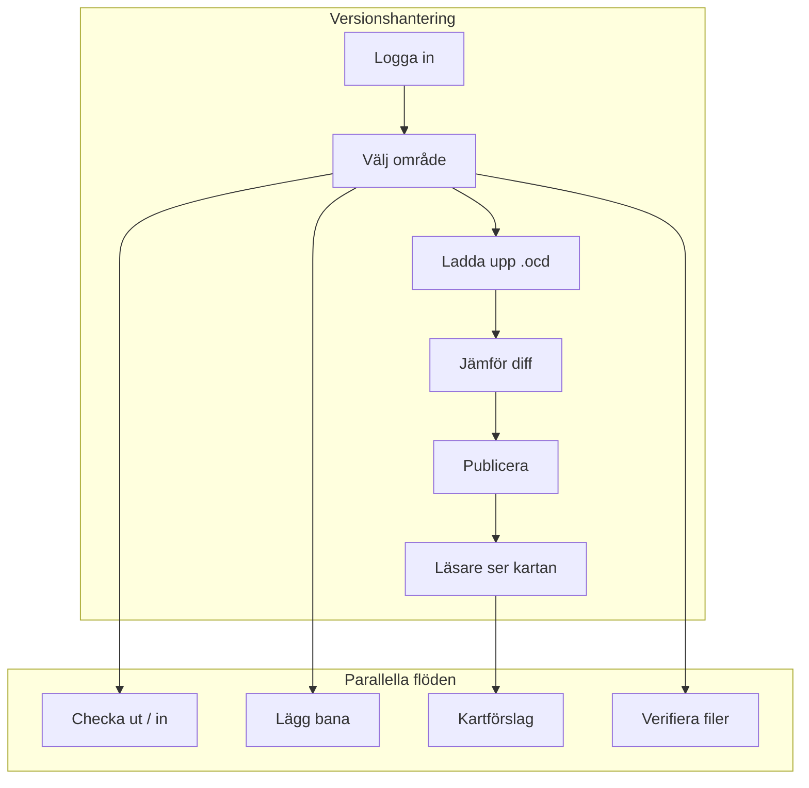
```mermaid
flowchart TB
  subgraph core ["Versionshantering"]
    A[Logga in] --> B[Välj område]
    B --> C[Ladda upp .ocd]
    C --> D[Jämför diff]
    D --> E[Publicera]
    E --> F[Läsare ser kartan]
  end

  subgraph parallel ["Parallella flöden"]
    B --> G[Checka ut / in]
    B --> H[Lägg bana]
    F --> I[Kartförslag]
    B --> J[Verifiera filer]
  end
```
<!-- /diagram:helhet -->

### Användarfall

**«Säsongstart — alla ska komma igång»**

1. Kontrollera att rätt version är publicerad på alla aktiva områden.
2. Godkänn nya konton.
3. Kommunicera länk till `/hjalp/guide` och detta kursmaterial.

---

## Del 3 — Slutchecklista

- [ ] Godkänt konto med korrekt roll
- [ ] Skapat eller förvaltat område ( skapa / arkivera )
- [ ] Förstått integrationsflöde för incheckning
- [ ] Besökt lagring och inställningar
- [ ] Kan beskiva hela flödet från uppladdning till publicering för en ny karta

---

# Bilaga A — Snabbreferens per funktion

| Funktion | Läsare | Redaktör | Admin | Var |
|----------|:------:|:--------:|:-----:|-----|
| Se publicerad karta | ✓ | ✓ | ✓ | Startsida → område → kartvy |
| Kartförslag | ✓ | ✓ | ✓ | Områdessida → Föreslå ändring |
| Lägg bana | ✓ | ✓ | ✓ | Områdessida → Lägg bana / Banor (N) |
| Export PDF/OCAD/GeoTIFF | ✓ | ✓ | ✓ | Kartvy |
| Verifiera (.ocd) | ✓ | ✓ | ✓ | `/verifiera` |
| Jämför versioner | ✓* | ✓ | ✓ | Områdessida |
| Ladda upp version | | ✓ | ✓ | Områdessida |
| Publicera | | ✓ | ✓ | Versionshistorik |
| Utcheckning/incheckning | | ✓ | ✓ | Områdessida |
| Granska kartförslag | | ✓ | ✓ | Områdessida |
| Skapa område | | | ✓ | Startsida |
| Godkänn användare | | | ✓ | Admin → Användare |
| Integrera incheckning | | | ✓ | Admin / områdessida |
| Systeminställningar | | | ✓ | Admin → Inställningar |

\* Läsare ser bara publicerade versioner i jämförelse.

---

# Bilaga B — Bildindex

| Bild-ID | Del | Beskrivning |
|---------|-----|-------------|
| 1.1 | 1 | Inloggning, skapa konto |
| 1.2 | 1 | Profildialog, läsare |
| 2.1 | 1 | Startsida, områdeslista |
| 2.2 | 1 | Versionshistorik, publicerad |
| 2.3 | 1 | Kartvy |
| 3.1 | 1 | Knappen Föreslå ändring |
| 3.2 | 1 | Kartförslagsvy, ritverktyg |
| 3.3 | 1 | Lista kartförslag |
| 4.1 | 1 | Sidhuvud knappar inkl. Lägg bana |
| 4.2 | 1 | Banredigerare |
| 4.3 | 1 | Klipp / lucka i kontroll |
| 4.4 | 1 | Skuggbana (valfritt) |
| 5.1 | 1 | Exportdialog |
| 5.2 | 1 | Verifiera |
| 5.3 | 1 | Versionsdiff (valfritt) |
| 6.1 | 2 | Ladda upp version |
| 6.2 | 2 | Diff efter uppladdning |
| 6.3 | 2 | Versionshistorik alla status |
| 7.1 | 2 | Publicera-knapp |
| 7.2 | 2 | Statusbanner publicerad |
| 8.1 | 2 | Utcheckning polygon |
| 8.2 | 2 | Översiktskarta utcheckningar |
| 8.3 | 2 | Incheckning diff |
| 8.4 | 2 | Utcheckningslista |
| 9.1 | 2 | Kartförslag antal |
| 9.2 | 2 | Kartförslag detalj |
| 10.1 | 2 | Jämförelse två versioner |
| 10.2 | 2 | Diff-PDF (valfritt) |
| 11.1 | 3 | Admin användare pending |
| 11.2 | 3 | Godkänn roll |
| 12.1 | 3 | Skapa område |
| 12.2 | 3 | Arkivera område |
| 12.3 | 3 | Redigera namn (valfritt) |
| 13.1 | 3 | Admin utcheckningar |
| 13.2 | 3 | Integrera incheckning |
| 13.3 | 3 | Avbryt utcheckning (valfritt) |
| 14.1 | 3 | Admin lagring |
| 14.2 | 3 | Admin inställningar SMTP |
| 14.3 | 3 | Loggning/feedback (valfritt) |

Flödesdiagrammet som tidigare låg som bild 15.1 är numera ett Mermaid-diagram i modul 3.5.

---

# Bilaga C — Felsökning ( vanliga problem )

| Problem | Möjlig orsak | Åtgärd |
|---------|--------------|--------|
| Ser inget område | Ingen publicerad version | Be redaktör publicera |
| «Lägg bana» inaktiv | Ingen publicerad version | Publicera kartversion först |
| Kan inte ladda upp | Du är läsare | Be om redaktörsbehörighet |
| Utcheckning går inte | Ingen version på området | Ladda upp minst en version |
| Får inget e-post | SMTP ej konfigurerat / notiser av | Admin kontrollerar inställningar; kolla spam |
| Konto väntar | Ej godkänt | Admin godkänner under Användare |

---

# Bilaga D — så uppdaterar du bilderna

Skärmdumparna tas automatiskt av ett skript som loggar in i appen, går igenom sidorna och
skriver in bilderna i det här dokumentet. Kör om det när gränssnittet ändrats, så är materialet
aktuellt igen utan handpåläggning.

### Skapa ett konto för dokumentationen

Skriptet behöver logga in. Använd ett eget konto för ändamålet i stället för ditt personliga —
då syns inte ditt namn i bilderna och lösenordet kan bytas utan att påverka någon.

1. Logga in som administratör och gå till **Admin → Användare**.
2. Under **Skapa nytt konto**: fyll i namn (t.ex. `Dokumentation`), e-post, ett lösenord på minst
   8 tecken och välj rollen **Administratör**.
3. Klicka **Skapa konto**. Kontot godkänns automatiskt och fungerar direkt.

Rollen bör vara **Administratör** — annars hoppas bilderna i del 3 och delar av del 2 över,
eftersom kontot inte kommer åt de sidorna. Skriptet säger till om rollen inte räcker.

Använd **inte** «Glömt lösenord?» för det här kontot. Det ger ett tillfälligt lösenord som måste
bytas vid inloggning, och då fastnar skriptet på sidan för lösenordsbyte.

### Kör

```bash
cd web
npx playwright install chromium        # bara första gången

DOCS_BASE_URL=https://kartor.ifkmora.se \
DOCS_EMAIL=dokumentation@ifkmora.se \
DOCS_PASSWORD='lösenordet-du-satte' \
npm run docs:screenshots
```

Lösenordet ska aldrig checkas in — skicka det som miljövariabel vid körning. Utan `DOCS_EMAIL`
tas bara inloggningssidan.

### Miljövariabler och flaggor

| Variabel / flagga | Betydelse |
|-------------------|-----------|
| `DOCS_BASE_URL` | Adress till appen (standard `http://localhost:3000`) |
| `DOCS_EMAIL`, `DOCS_PASSWORD` | Inloggning |
| `DOCS_AREA_SLUG` | Tvinga ett visst kartområde i stället för automatiskt val |
| `--only=2.1,4.2` | Ta om bara vissa bilder |
| `--headed` | Visa webbläsaren medan bilderna tas |
| `--skip-capture` | Skriv bara om dokumentet utifrån bilder som redan finns |

### Bilder som tas för hand

Ett tiotal bilder kräver ett läge som inte går att skapa utan att ändra riktig data — till
exempel att arkivera ett område eller öppna dialogen för att integrera en incheckning. De är
markerade med **Tas för hand** i texten. Så här lägger du in en sådan bild:

1. Ta skärmdumpen manuellt.
2. Spara den som `docs/bilder/<bild-id>.png`, till exempel `docs/bilder/4.3.png`.
3. Kör `npm run docs:screenshots -- --skip-capture` så byts platshållaren mot bilden.

### Flödesdiagram

Diagrammen är Mermaid och renderas direkt av GitHub. De hämtas från
`web/src/lib/help/process-diagrams.ts` — alltså exakt samma diagram som hjälpen i appen visar —
och skrivs in av samma skript. Ändra aldrig ett diagram direkt i den här filen; ändra i
källfilen och kör skriptet.

---

*Senast uppdaterad: 2026-09-01. Matchar Kartbanken inkl. Klipp-verktyg i banläggning och knapp «Lägg bana» / «Banor (N)» i sidhuvudet.*
